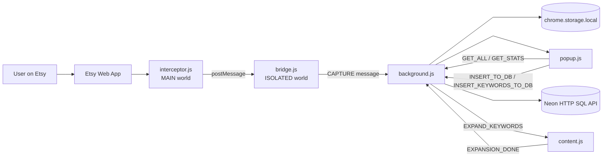
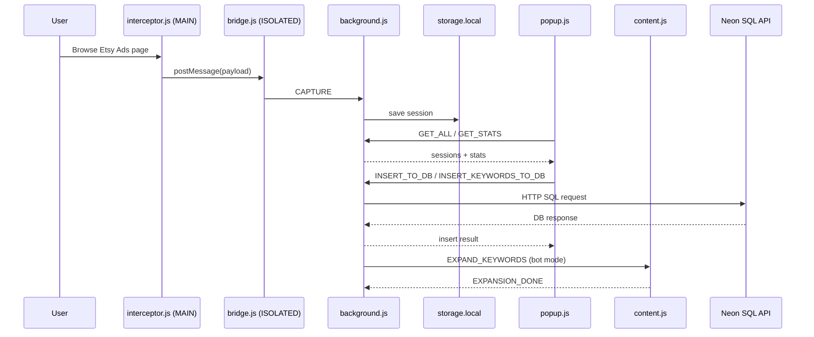

# Getify Ads Spy - Technical & Status Report

> Tài liệu này mô tả architecture hiện tại của extension Getify Ads Spy (Firefox), data flow, rủi ro bị Etsy phát hiện khi chạy bot behavior (auto-expand/auto-scroll).

---

## 1) Mục tiêu của extension

Extension được thiết kế để:

1. Thu thập Etsy Ads API responses khi user duyệt Etsy Ads Dashboard.
2. Chuẩn hóa dữ liệu raw thành dữ liệu clean (`listing_report_rows`, `keyword_report_rows`).
3. Export dữ liệu (raw/clean/CSV) hoặc insert trực tiếp vào Neon/PostgreSQL qua HTTP SQL.
4. Hỗ trợ manual queue và automated bot cho keyword page của từng listing.

## 2) Architecture overview

Luồng chính:

1. **`interceptor.js`** patch `fetch` + `XMLHttpRequest` để capture JSON response theo pattern.
2. Dữ liệu được đẩy qua `window.postMessage(...)`.
3. **`bridge.js`** nhận message, validate, rồi forward bằng `chrome.runtime.sendMessage({ action: "CAPTURE" ... })`.
4. **`background.js`** lưu vào `chrome.storage.local`, xử lý DB insert, queue, bot orchestration.
5. **`popup.js` + `popup.html` + `popup.css`**: UI cho export, DB settings, queue management và bot status.
6. **`content.js`** chạy trên keyword listing page, thực hiện auto-expand/auto-scroll với random timing, rồi gửi `EXPANSION_DONE` về background.

### Extension architecture

## 3) Runtime context & module responsibilities

### 3.1 `interceptor.js`

**Vai trò**

- Intercept API response ngay trong cùng JS runtime của Etsy app.

**Cách hoạt động**

- Dùng `API_PATTERNS` để match request cần capture, và `IGNORE_PATTERNS` để lọc noise.
- Patch:
  - `window.fetch`
  - `XMLHttpRequest.prototype.open/send`
- Chỉ xử lý response có JSON `content-type`.
- Gửi payload qua `window.postMessage` với compact keys (`_u`, `_s`, `_b`, `_t`).

**Cơ chế Anti-bot:**

- Spoof `Function.prototype.toString`: Overwrite hàm `toString` mặc định để luôn trả về chuỗi `[native code]`. Khi hệ thống Anti-bot của Etsy (như DataDome) rà quét các hàm đã bị extension can thiệp (như `fetch` hay `XMLHttpRequest`), hàm này giúp che dấu vết của network hooks, đánh lừa Etsy rằng đây vẫn là hàm gốc của trình duyệt.
- Patch logic liên quan `iframe` creation để tránh lấy clean reference của network hooks.

### 3.2 `bridge.js`

**Vai trò**

- Là secure bridge từ page runtime sang extension runtime.

**Cách hoạt động**

- Chỉ chấp nhận message có `type` đúng (`__RDT_UPD_a9f3c`) và `event.source === window`.
- Decode payload thành `{ url, status, body, timestamp }`.
- Estimate payload size và forward cho background qua `chrome.runtime.sendMessage`.

### 3.3 `background.js`

Nằm giữa và đóng vai trò central orchestrator.

**A. Capture & Storage**

- Lưu session vào `chrome.storage.local` với key `getify_sessions`.
- Auto cleanup dữ liệu cũ theo `MAX_AGE_DAYS = 30`.
- Hiển thị capture count trên extension badge.

**B. DB integration (Neon HTTP SQL)**

- Lưu DB config key `getify_db_config`.
- Parse PostgreSQL connection string.
- Gọi endpoint `https://<host>/sql` với header `Neon-Connection-String`.
- Hỗ trợ:
  - connection test
  - insert `listing_report`
  - insert `keyword_report`
- Có input validation + required fields + pre-check listing tồn tại trước keyword insert.

**C. Queue**

- Queue key: `getify_keyword_queue_v2`.
- Hỗ trợ queue get/save, add listing IDs, update item status.

**D. Bot state**

- States:
  - `idle | opening | expanding | capturing | saving | waiting_user | complete`
- Random timers:
  - pre-expand, settle, expand timeout, next pause
- Flow:
  1. Start -> shuffle pending queue.
  2. Open/reuse keyword listing tab.
  3. Gửi `EXPAND_KEYWORDS` cho `content.js`.
  4. Chờ API settle.
  5. Build keyword rows từ sessions.
  6. Insert DB.
  7. Mark `done/skipped/error`, clear sessions, chuyển listing tiếp theo.

### 3.4 `content.js`

Chạy trên keyword stats URL của từng listing.

**Vai trò**

- Mô phỏng hành vi của user (user interaction) để expand keyword table:
  - tìm nút “See all / Show more / Load more / ...”
  - click theo random interval
  - smooth scroll + pause

**Auto-scroll behavior (bot behavior)**

- `content.js` không scroll liên tục theo loop cố định. Thay vào đó dùng `humanScroll()` để tạo nhịp giống user:
  - scroll một đoạn ngẫu nhiên khoảng `250–550px`,
  - dùng `window.scrollBy({ behavior: "smooth" })`,
  - pause ngẫu nhiên `700–1400ms` sau mỗi lần scroll.
- Trước khi thao tác expand, bot chờ keyword section xuất hiện tối đa khoảng `24–28s` và kiểm tra theo chu kỳ `900–1600ms`.
- Khi keyword section đã có, flow auto-scroll/expand diễn ra như sau:
  1. Scroll mở đầu 1 lần (giống hành vi đọc trang).
  2. Nghỉ `1200–2500ms`.
  3. Chạy tối đa `6` vòng tìm và click nút expand.
  4. Mỗi click cách nhau `400–900ms`.
  5. Sau mỗi vòng có click, bot scroll thêm 1 lần rồi chờ `2200–4000ms` để data lazy-load.
  6. Cuối cùng scroll thêm 1 lần + nghỉ `800–1500ms`, sau đó phát `EXPANSION_DONE`.
- Ngoài `content.js`, `background.js` còn thêm guard timing để hành vi không quá dồn dập:
  - pre-expand delay `3–6s` sau khi tab load xong mới gửi `EXPAND_KEYWORDS`,
  - fallback expand timeout `14–22s` nếu không có tín hiệu expansion kỳ vọng.

**Completion signal**

- Gửi `chrome.runtime.sendMessage({ action: "EXPANSION_DONE" })` để background chuyển bot state.

### 3.5 Popup UI: `popup.js`, `popup.html`, `popup.css`

**Vai trò**

- Control panel cho toàn extension, gồm các action chính:
  - **"Export Clean"**
  - **"Export Raw"**
  - **"Export Listing CSV"**
  - **"Add Listings to DB"**
  - **"Add Keywords to DB"**
  - **"Settings"**
  - **"Save"**
  - **"Test Connection"**
  - **"Refresh"**
  - **"Open Next"**
  - **"Mark Done"**
  - **"Reset"**
  - **"Start Bot"**
  - **"Stop Bot"**
  - **"Retry"**
  - **"Skip & Move Next"**

**ETL logic chính trong popup**

- `transformToClean(...)`: chuyển raw sessions sang analytics schema.
- Build rows cho:
  - `listing_report_rows`
  - `keyword_report_rows`

### 3.6 Configuration & metadata

- `manifest.json`: định nghĩa permissions, content scripts, popup, background scripts.
- `config.js`: VM metadata (`APP_CONFIG.VM_NAME`) gắn vào export/insert rows.

## 4) Storage keys & E2E data flow

### 4.1 Storage keys (`chrome.storage.local`)

| Key                              | Mô tả                                           |
| -------------------------------- | ----------------------------------------------- |
| `getify_sessions`                | Danh sách API responses đã capture              |
| `getify_db_config`               | Neon connection string                          |
| `getify_keyword_queue_v2`        | Listing queue cho keyword workflow              |
| `getify_keyword_url_template_v1` | URL template cho keyword page có `{listing_id}` |

### 4.2 E2E data flow

1. User mở Etsy Ads Dashboard hoặc keyword listing page.
2. `interceptor.js` capture ads/keyword JSON responses.
3. `bridge.js` forward message sang `background.js`.
4. `background.js` persist sessions vào storage.
5. Popup đọc sessions và chuyển thành clean data.
6. User:
   - export file, hoặc
   - insert trực tiếp vào DB.
7. Với bot mode:
   - queue -> open listing -> expand -> capture -> save DB -> next listing.

### 4.3 E2E sequence

## 5) Bot state flow

```mermaid
%%{init: {"flowchart": {"curve": "linear"}}}%%
flowchart TB
  Start(( )) --> idle([idle])
  idle -->|BOT_START| opening([opening])
  opening -->|tab loaded| expanding([expanding])
  expanding -->|EXPANSION_DONE / fallback| capturing([capturing])
  capturing -->|settle timer| saving([saving])

  saving -->|save ok + next listing| opening
  saving -->|db_error / no_data| waiting_user([waiting_user])
  waiting_user -->|retry / skip| opening

  opening -->|queue exhausted| complete([complete])
  complete -->|new start| idle
  idle --> End(( ))

  classDef blackDot fill:#000,stroke:#000,stroke-width:2px;
  class Start,End blackDot;
```

## 6) Phân tích rủi ro bị Etsy detect

### 6.1 TL;DR

Rủi ro phụ thuộc vào operating mode:

- **Low** khi chạy chủ yếu manual, bot ít, session ngắn, tốc độ thấp.
- **Medium -> High** khi chạy bot liên tục, nhiều listing liên tiếp trong thời gian dài.

Không thể cam kết “an toàn tuyệt đối” vì anti-abuse system của Etsy có thể thay đổi theo thời gian.

### 6.2 Detection vectors

**A) Automation behavior fingerprint**

- Action chain lặp lại (open -> expand -> wait -> save -> next) trong thời gian dài.
- Tần suất thao tác cao hơn user behavior thông thường.
- Random timing nhưng vẫn nằm trong fixed ranges.

**B) Runtime patch footprint**

- Extension patch trực tiếp `fetch`, `XMLHttpRequest`, `Function.prototype.toString`, `document.createElement`.
- Nếu Etsy/anti-bot chạy deep integrity checks, khả năng bị phát hiện sẽ tăng.

**C) Server-side correlation**

- Request volume bất thường trên cùng account/IP.
- Navigation pattern quá đều hoặc kéo dài nhiều giờ.
- Nhiều account có behavior giống nhau trên cùng network infrastructure.

### 6.3 Mức rủi ro theo mode sử dụng

| Mode                            | Mô tả                                                 | Rủi ro tương đối     |
| ------------------------------- | ----------------------------------------------------- | -------------------- |
| Manual only                     | User thao tác chính, extension chủ yếu capture/export | Low                  |
| Manual queue + open per listing | Có auto-open tab nhưng page automation ít             | Low-Medium           |
| Auto bot (short controlled run) | Auto expand/scroll + auto save                        | Medium               |
| Auto bot liên tục, volume lớn   | Long-running, nhiều listing, ít break                 | Medium-High đến High |

### 6.4 Warning signs

Nên dừng extension ngay nếu:

1. Etsy hiển thị CAPTCHA/challenge hoặc re-auth bất thường.
2. Keyword page/load behavior lỗi thất thường tăng mạnh.
3. Account có warning liên quan activity/policy.
4. Error rate của requests tăng đột biến.

## 7) Known Limitations & Next Steps

### 7.1 Fallback timeout khi Etsy UI thay đổi

**Limitation**

- Nếu Etsy thay đổi UI/selector khiến bot khó tìm thấy nút expand đúng lúc, flow có nguy cơ chậm hoặc treo ở một số session.

**Current mitigation**

- `content.js` có cơ chế chờ có giới hạn (deadline) và luôn phát `EXPANSION_DONE` khi kết thúc luồng expand.
- `background.js` có fallback timeout (`BOT_EXPAND_LIMIT`) để chuyển tiếp sang settle/save, tránh treo bot vô hạn.

**Next step**

- **Phase Logging:** Triển khai hệ thống ghi log (logging marker) chi tiết cho từng giai đoạn của State Machine (`opening`, `expanding`, `capturing`, `saving`). Việc này cho phép nhanh chóng xác định chính xác vị trí lỗi khi Etsy thực hiện thay đổi giao diện lớn.

### 7.2 Bảo mật DB connection string ở client-side

**Limitation**

- Neon connection string hiện được lưu ở client-side (`chrome.storage.local`), nên có rủi ro lộ credential nếu môi trường máy người dùng bị compromise.

**Next step**

1. Chỉ cấp connection string thuộc DB role có quyền **INSERT-ONLY** (không có UPDATE/DELETE/DDL).
2. Đặt rotation policy định kỳ cho credential.

